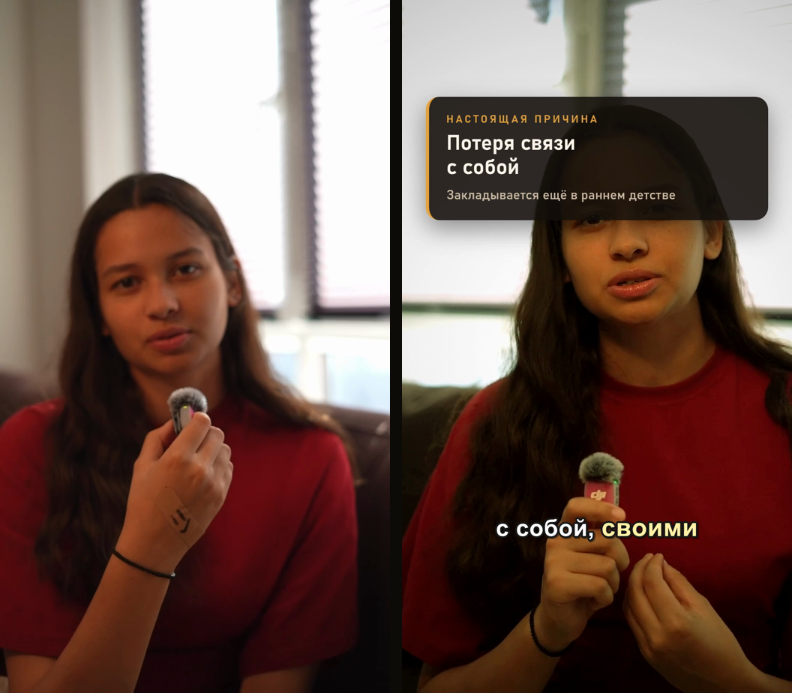
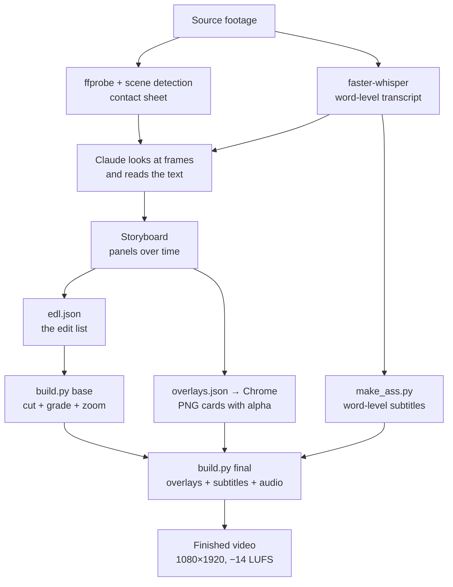
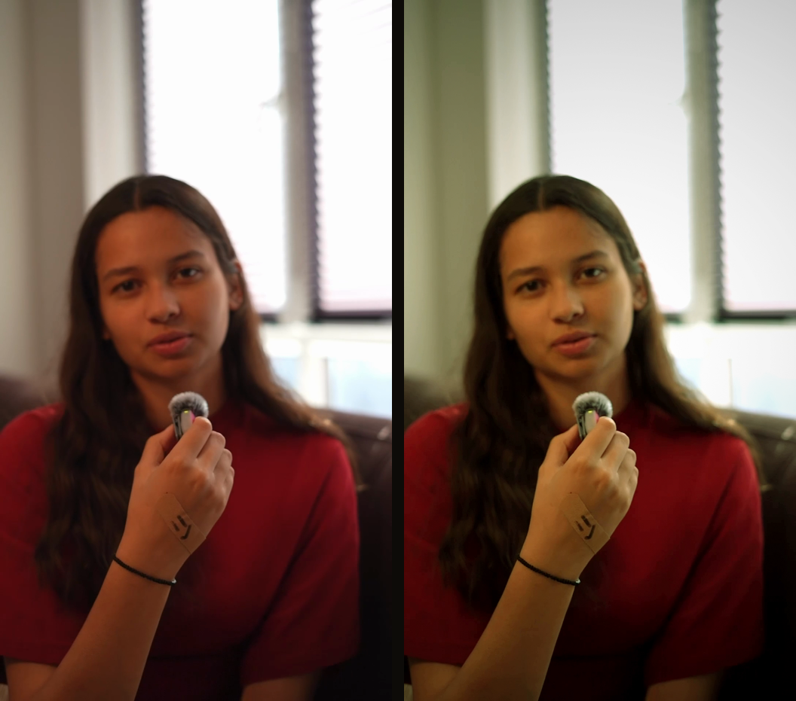
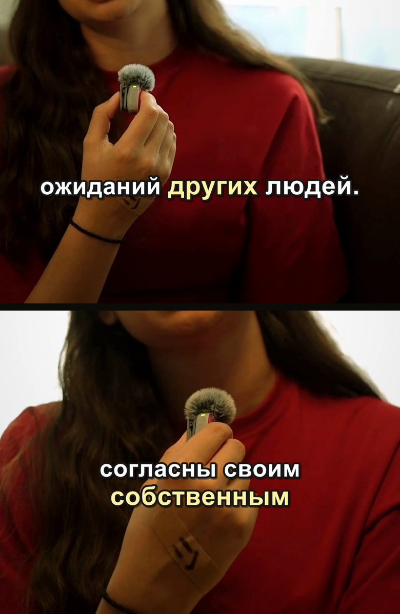
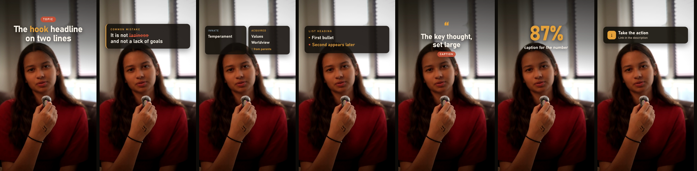
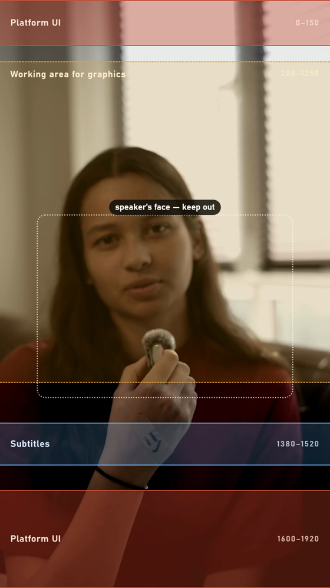
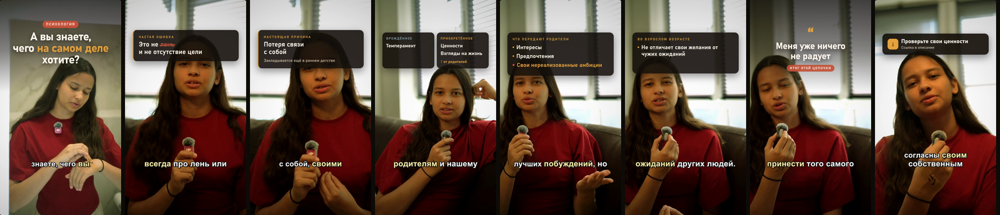

# videoediting — a video editing skill for Claude Code

Edit vertical videos without a video editor. Claude cuts the footage by speech, grades the picture, burns in word-level subtitles and draws infographics — all through ffmpeg, all editable as text, all rebuilt with a single command.

*Read this in [Русский](README.ru.md).*



*Left — a frame straight off the phone. Right — the same moment after processing: colour grade, thesis card, word-level subtitles. The sample footage is in Russian; the pipeline is language-agnostic.*

---

## What this is

Conventional editing means a mouse, a timeline and an hour of work per finished minute. This takes a different route: **the edit is described as text**, and Claude turns that description into ffmpeg commands.

The trick is that the video is never analysed pixel by pixel. First a transcript is produced with word-level accuracy, and the entire structure of the video is derived from it — where to cut, what to promote into graphics, where the accents go. Speech provides the skeleton; the picture serves it.

Concrete result: a 1:12 talking-head monologue shot on an iPhone becomes a finished 1:08 video with a grade, 164 subtitle events and 12 infographic cards.

## What it does

| Capability | How |
|---|---|
| Semantic cutting, removing pauses and filler | transcript + `edl.json` edit list |
| Punch-in — changing framing across cuts | `crop` + `scale`, alternating zoom |
| Colour grading | `eq` + `curves` + `vignette`, `.cube` LUT support |
| Word-level subtitles with the active word highlighted | ASS + libass |
| Infographics, cards, diagrams, titles | HTML/CSS → headless Chrome → PNG with alpha → `overlay` |
| Stabilisation | `vidstabdetect` + `vidstabtransform` |
| Loudness normalisation for social platforms | `loudnorm` to −14 LUFS |
| Several videos from one source | one transcript, several `edl.json` files |

**What it does not do**, stated up front: frame-accurate creative cutting, object tracking, masks and masked grading, complex motion graphics. Those need Premiere, DaVinci or After Effects.

## Quick start

```bash
git clone https://github.com/YOUR-NAME/claude-videoediting-skill.git
cd claude-videoediting-skill
```

**Windows:**

```powershell
powershell -ExecutionPolicy Bypass -File scripts/install.ps1
```

**macOS / Linux:**

```bash
bash scripts/install.sh
```

The script copies the skill into `~/.claude/skills/videoediting/` and reports which dependencies are missing. Then open Claude Code in the folder holding your footage:

```
/videoediting edit IMG_1234.MOV for Reels, the topic is burnout
```

Claude will install whatever is missing (ffmpeg, faster-whisper, Chrome), inspect the source, transcribe it and show you the structure **before** rendering anything.

Full installation, including on a machine with nothing on it — [INSTALL.md](INSTALL.md).

## How it works



The key detail is that **assembly is split into two stages**. `base` computes the cut and the colour, which is slow. `final` composites graphics and subtitles, which is fast. So cards and titles can be iterated endlessly without recomputing the cut.

The other one: **the entire state of the edit lives in three JSON files.** Want to move a cut — change a number in `edl.json`. Want different copy on a card — change the HTML in `overlays.json`. No binary project files; everything is versioned in git and editable by hand or by Claude.

## What is inside the skill

```
skill/videoediting/
├── SKILL.md                      the workflow and 10 rules that make or break a video
├── references/
│   ├── setup.md                  installing on a clean machine (Windows/macOS)
│   ├── pipeline.md               8 steps with commands + an acceptance checklist
│   ├── storyboard.md             video formats, 9 panel types, converting timings
│   ├── design-system.md          palette, type scale, safe zones, techniques
│   ├── ffmpeg-cookbook.md        grades, effects, transitions, audio, encoding
│   └── troubleshooting.md        14 failures, each of which cost an hour of debugging
└── assets/
    ├── tools/                    6 working scripts — copied into the project as-is
    └── templates/                starter edl.json, overlays.json, corrections.json
```

`SKILL.md` is deliberately short — Claude reads it whole and pulls in the reference files only when they are needed, so the context does not fill up with things this particular job never touches.

### The scripts

| Script | What it does |
|---|---|
| `transcribe.py` | faster-whisper → `transcript.json` with word-level timings and `.srt` |
| `pauses.py` | lists pauses in the speech — the basis for the edit list |
| `dump_words.py` | every word with its index and recognition confidence — for proofreading |
| `make_ass.py` | word-level ASS subtitles, re-timed onto the post-cut timeline |
| `render_overlays.py` | HTML/CSS → headless Chrome → 1080×1920 PNG with a transparent background |
| `build.py` | assembly: `base` (cut + grade), `final` (overlays + subtitles + audio) |

### The edit list

The edit itself looks like this — plain JSON, edited by hand:

```json
{
  "source": "D:\\video\\IMG_1234.MOV",
  "segments": [
    { "start": 0.00,  "end": 2.11,  "zoom": 1.00,  "t": "hook — opening line" },
    { "start": 2.36,  "end": 6.28,  "zoom": 1.045, "t": "hook continues" },
    { "start": 7.21,  "end": 10.52, "zoom": 1.00,  "t": "myth busted" }
  ]
}
```

Everything between the segments is cut. `zoom` alternates so that each cut reads as a change of angle rather than a mistake.

## What the output looks like

### Colour grading



*Left the source, right after grading. The face is lifted out of hard backlight, contrast and warmth are added to the skin, and a soft vignette keeps the eye on the subject. Different locations inside one video are reconciled to a common look.*

### Word-level subtitles



*The active word is tinted and slightly enlarged. Long lines wrap instead of running off the edge. The position clears the platform UI so Reels buttons never sit on the text.*

### Infographic panel types



*Hook title, rebuttal with a strike-through, two-column diagram, list with bullets appearing one at a time, pull quote, big number, CTA. All of them are plain HTML/CSS — you can draw anything.*

### Safe zones



*The rule broken on almost every first attempt: **a card goes above the face, never on it**. The speaker's gaze is half the trust the video earns.*

### The finished video, frame by frame



*Eight moments from a 68-second video: hook, thesis, diagram, list, climax, two CTAs. Between the blocks there is deliberately a stretch with no graphics — the viewer needs air.*

## Requirements

| Component | Why | Required |
|---|---|---|
| [Claude Code](https://claude.com/claude-code) | the agent itself | yes |
| ffmpeg (**full build**) | the entire edit | yes |
| Python 3.10+ | the pipeline scripts | yes |
| faster-whisper | word-level transcript | yes |
| Google Chrome | rendering infographics to PNG | yes, if you want graphics |
| 4 GB of disk space | the speech recognition model | yes |

Stripped-down ffmpeg builds will not do — the `subtitles` (libass) and `lut3d` filters are required. There is a check in [INSTALL.md](INSTALL.md).

Runs on Windows, macOS and Linux. Developed and debugged on Windows 11.

## About the name

The skill is called `videoediting` and is invoked with `/videoediting`. The name is deliberate: popular marketing skill packs for Claude Code already claim `video` for AI footage generation (Veo, Sora, HeyGen, Remotion), which is a completely different job, and two skills named `video` in one environment only confuse the agent.

To rename it, change the folder name and the `name:` field on the second line of `SKILL.md`. The name is not referenced anywhere else.

## Limitations and honest caveats

- **Speech recognition gets words wrong even on clean audio.** The `small` model makes roughly ten mistakes per minute, `large-v3` one or two. That is why the pipeline has a dedicated proofreading step and a `corrections.json` file keyed by word index. Do not skip it — an error burned into the subtitles is permanent.
- **The first model download is slow** — 0.5 to 3 GB depending on the model you pick. After that it is cached.
- **A cut placed where the subject is moving** (standing up, fixing their hair) looks like a mistake. The pipeline does not fix this automatically — those spots must be avoided or covered with graphics. Hence the hard rule to review the contact sheet before building the edit list.
- **This does not replace an editor on a complex project.** It is a way to produce a steady stream of similar vertical videos quickly and predictably.

A full list of known failures lives in `skill/videoediting/references/troubleshooting.md`.

## Credits

The pipeline builds on ideas from several open projects:

- [browser-use/video-use](https://github.com/browser-use/video-use) — editing driven by a word-level transcript
- [HUANGCHIHHUNGLeo/claude-real-video](https://github.com/HUANGCHIHHUNGLeo/claude-real-video) — source breakdown, scene detection
- [bradautomates/claude-video](https://github.com/bradautomates/claude-video) — letting the agent look at video frame by frame
- [digitalsamba/claude-code-video-toolkit](https://github.com/digitalsamba/claude-code-video-toolkit) — transition library, the brand-profile idea

## Licence

MIT — see [LICENSE](LICENSE).

The screenshots in this README come from a real project and are published with the consent of everyone who appears in them.
