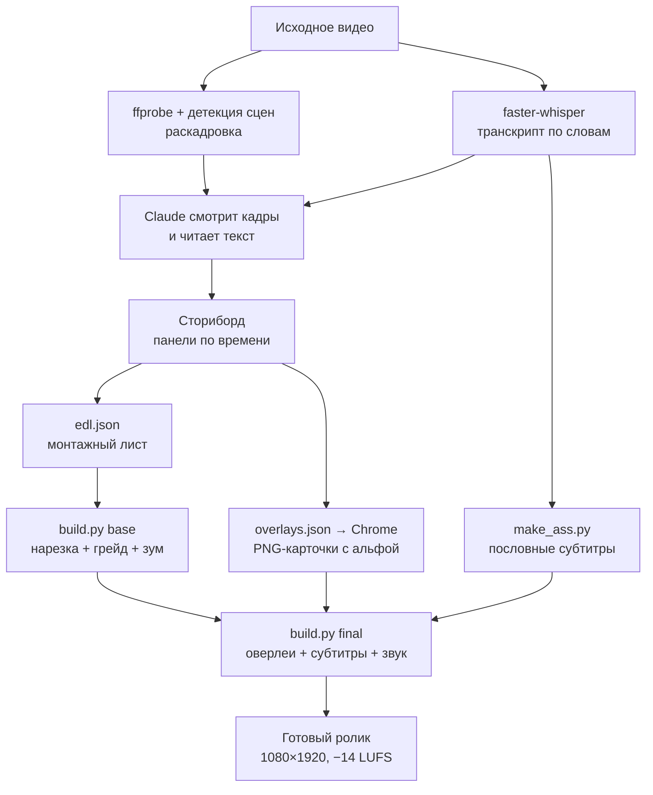

# videoediting — скилл видеомонтажа для Claude Code

Монтаж вертикальных роликов без видеоредактора. Claude режет видео по речи, красит картинку, вжигает пословные субтитры и рисует инфографику — всё через ffmpeg, всё правится текстом и пересобирается одной командой.

*In [English](README.md).*


*Слева — кадр из исходника с телефона. Справа — тот же момент после обработки: грейд, карточка-тезис, пословные субтитры.*

---

## Что это

Обычный монтаж — это мышка, таймлайн и час работы на минуту готового видео. Здесь другой подход: **монтаж описывается текстом**, а Claude превращает описание в ffmpeg-команды.

Смысл в том, что видео не анализируется по пикселям. Сначала снимается транскрипт с точностью до слова, дальше вся структура ролика строится по нему — где резать, что вынести в графику, куда поставить акцент. Речь задаёт каркас, картинка его обслуживает.

Практический результат: разговорный монолог 1:12, снятый на iPhone, превращается в готовый ролик 1:08 с грейдом, 164 событиями субтитров и 12 карточками инфографики.

## Что умеет

| Возможность | Как сделано |
|---|---|
| Нарезка по смыслу, удаление пауз и слов-паразитов | транскрипт + монтажный лист `edl.json` |
| Punch-in — смена крупности на склейках | `crop` + `scale`, чередование зума |
| Цветокоррекция | `eq` + `curves` + `vignette`, поддержка `.cube` LUT |
| Пословные субтитры с подсветкой активного слова | ASS + libass |
| Инфографика, карточки, схемы, титры | HTML/CSS → headless Chrome → PNG с альфой → `overlay` |
| Стабилизация | `vidstabdetect` + `vidstabtransform` |
| Нормализация звука под соцсети | `loudnorm` до −14 LUFS |
| Несколько роликов из одного исходника | один транскрипт, разные `edl.json` |

**Чего не умеет** (честно, чтобы не было сюрпризов): покадровой точности на творческих склейках, трекинга объектов, масок и грейда по маскам, сложной моушн-графики. Для этого нужен Premiere, DaVinci или After Effects.

## Быстрый старт

```bash
git clone https://github.com/ВАШ-НИК/claude-videoediting-skill.git
cd claude-videoediting-skill
```

**Windows:**

```powershell
powershell -ExecutionPolicy Bypass -File scripts/install.ps1
```

**macOS / Linux:**

```bash
bash scripts/install.sh
```

Скрипт копирует скилл в `~/.claude/skills/videoediting/` и показывает, чего не хватает из зависимостей. Дальше открываешь Claude Code в папке с видео:

```
/videoediting смонтируй IMG_1234.MOV под Reels, тема — выгорание
```

Claude сам доставит недостающее (ffmpeg, faster-whisper, Chrome), разберёт исходник, снимет транскрипт и покажет структуру ролика **до** того, как что-то рендерить.

**Важно:** сам скилл написан на английском — так его лучше понимает модель. Общаться с ним можно на любом языке, и субтитры он делает на языке исходника.

Подробная установка, в том числе на машину, где нет вообще ничего — [INSTALL.md](INSTALL.md).

## Как это работает



Ключевая деталь — **сборка разделена на два этапа**. `base` считает нарезку и цвет, это долго. `final` накладывает графику и субтитры, это быстро. Поэтому карточки и титры можно крутить сколько угодно, не пересчитывая нарезку.

Ещё одна — **всё состояние монтажа лежит в трёх JSON-файлах**. Захотел подвинуть склейку — поправил число в `edl.json`. Захотел другой текст на карточке — поправил HTML в `overlays.json`. Никаких бинарных проектных файлов, всё версионируется в git.

## Что внутри скилла

```
skill/videoediting/
├── SKILL.md                      порядок работы и 10 правил, нарушение которых портит ролик
├── references/
│   ├── setup.md                  установка на чистую машину (Windows/macOS)
│   ├── pipeline.md               8 шагов с командами + чек-лист приёмки
│   ├── storyboard.md             форматы роликов, 9 типов панелей, пересчёт таймингов
│   ├── design-system.md          палитра, кегли, безопасные зоны, приёмы
│   ├── ffmpeg-cookbook.md        грейды, эффекты, переходы, звук, кодирование
│   └── troubleshooting.md        14 ошибок, каждая стоила часа отладки
└── assets/
    ├── tools/                    6 рабочих скриптов — копируются в проект как есть
    └── templates/                заготовки edl.json, overlays.json, corrections.json
```

`SKILL.md` короткий — Claude читает его целиком, а справочники подгружает по мере надобности. Так контекст не забивается тем, что в этой задаче не нужно.

### Скрипты

| Скрипт | Что делает |
|---|---|
| `transcribe.py` | faster-whisper → `transcript.json` с пословными таймкодами и `.srt` |
| `pauses.py` | показывает паузы в речи — по нему строится монтажный лист |
| `dump_words.py` | все слова с индексами и уверенностью распознавания — для вычитки |
| `make_ass.py` | пословные ASS-субтитры, пересчитанные в тайминг после нарезки |
| `render_overlays.py` | HTML/CSS → headless Chrome → PNG 1080×1920 с прозрачным фоном |
| `build.py` | сборка: `base` (нарезка + грейд), `final` (оверлеи + субтитры + звук) |

### Монтажный лист

Сам монтаж выглядит так — обычный JSON, который правится руками:

```json
{
  "source": "D:\\видео\\IMG_1234.MOV",
  "segments": [
    { "start": 0.00,  "end": 2.11,  "zoom": 1.00,  "t": "хук — первая фраза" },
    { "start": 2.36,  "end": 6.28,  "zoom": 1.045, "t": "продолжение хука" },
    { "start": 7.21,  "end": 10.52, "zoom": 1.00,  "t": "опровержение мифа" }
  ]
}
```

Всё, что между сегментами, вырезается. `zoom` чередуется, чтобы склейка читалась как смена ракурса, а не как брак.

## Как выглядит результат

### Цветокоррекция


*Слева исходник, справа после грейда. Лицо вытянуто из контрового света, добавлен контраст и тепло в коже, мягкая виньетка держит взгляд на герое.*

### Пословные субтитры


*Активное слово подсвечивается и слегка увеличивается. Длинные строки переносятся, а не уезжают за край.*

### Типы панелей инфографики


*Хук-титул, опровержение с зачёркиванием, схема в две колонки, список с появлением по пунктам, цитата-акцент, крупная цифра, CTA. Всё верстается обычным HTML/CSS.*

### Безопасные зоны


*Правило, которое нарушается в первом заходе почти всегда: **карточка ставится над лицом, а не на него**.*

### Готовый ролик по кадрам


*Восемь моментов из ролика на 68 секунд. Между блоками обязательно оставлен участок без графики — зрителю нужен воздух.*

## Требования

| Компонент | Зачем | Обязателен |
|---|---|---|
| [Claude Code](https://claude.com/claude-code) | собственно агент | да |
| ffmpeg (**full build**) | весь монтаж | да |
| Python 3.10+ | скрипты пайплайна | да |
| faster-whisper | транскрипт с пословными таймкодами | да |
| Google Chrome | рендер инфографики в PNG | да, если нужна графика |
| 4 ГБ на диске | модель распознавания речи | да |

Урезанные сборки ffmpeg не подойдут — нужны фильтры `subtitles` (libass) и `lut3d`.

Работает на Windows, macOS и Linux. Отлаживалось на Windows 11.

## Про имя скилла

Скилл называется `videoediting` и вызывается командой `/videoediting`. Имя выбрано намеренно: популярные наборы маркетинговых скиллов занимают имя `video` под генерацию видео нейросетями (Veo, Sora, HeyGen, Remotion) — это другая задача, и два `video` в одном окружении путают агента.

Чтобы переименовать, поменяй имя папки и поле `name:` во второй строке `SKILL.md`. Больше нигде имя не используется.

## Ограничения

- **Распознавание речи врёт даже на чистом звуке.** Модель `small` даёт около десяти ошибок на минуту, `large-v3` — одну-две. Поэтому в пайплайне есть отдельный шаг вычитки и файл `corrections.json`. Не пропускай его: ошибка во вжатых субтитрах — навсегда.
- **Первая загрузка модели идёт долго** — от 0.5 до 3 ГБ. Дальше она в кэше.
- **Склейка там, где человек двигается**, выглядит как брак. Пайплайн это не чинит автоматически — такие места нужно обходить или закрывать графикой.
- **Это не замена монтажёру на сложном проекте.** Это способ быстро и предсказуемо делать поток однотипных вертикальных роликов.

Полный разбор известных ошибок — в `skill/videoediting/references/troubleshooting.md`.

## Благодарности

- [browser-use/video-use](https://github.com/browser-use/video-use) — идея монтажа по транскрипту с пословными таймкодами
- [HUANGCHIHHUNGLeo/claude-real-video](https://github.com/HUANGCHIHHUNGLeo/claude-real-video) — разбор исходника, детекция сцен
- [bradautomates/claude-video](https://github.com/bradautomates/claude-video) — покадровый просмотр видео агентом
- [digitalsamba/claude-code-video-toolkit](https://github.com/digitalsamba/claude-code-video-toolkit) — библиотека переходов, идея бренд-профилей

## Лицензия

MIT — см. [LICENSE](LICENSE).
